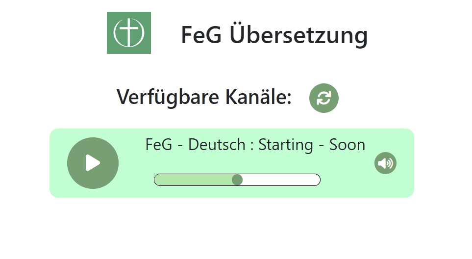

# local-interpreter-service
Radio broadcast for interpreter so the foreign guests are able to follow the sermon

## Setup
The following pictures shows the setup.

The System consists of 
- Main server
- Multiple interpreter PCs
- WiFi-Access-Points

The main server is running a radio-server that distributes broadcasted streams to 
all connected visitors. The web application to listen to the radio-steams can reached 
by qr-code

## Running Services:
### SSH 
- Port: 22 (like always)
### VNC
- Port: 5901
### IceCast2
- Port: 8000
- Configuration: `/etc/icecast2/icecast.xml`
### NginX
- Port: 80 / 443
- Config-File: `etc/nginx/nginx.conf`
- Websites: `/var/www/...`
### UniFi
- Port: 8443
### Active WebPages
- Station-Name: `FeG-Server`
    - accessible with `FeG-Server.local` in LAN
    - or with `FeG-Server.fritz.box`
- Radio-Stations `<ip|domain>/interpreter/stations/`

# ToDo:
There is still plenty to do with this ...
- Reduce latency 
- Test on all platforms
- Configuration File
- Multi-Language Support
- Provide a latency free solution for interpreters to listen to sermon
- things i have forgotten to mention here ... 