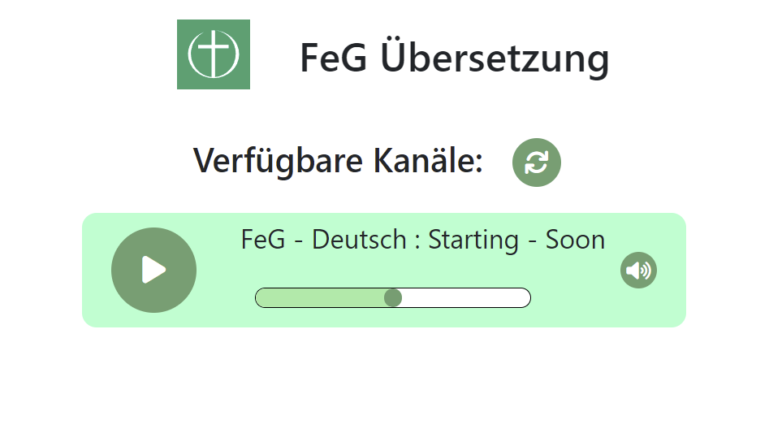
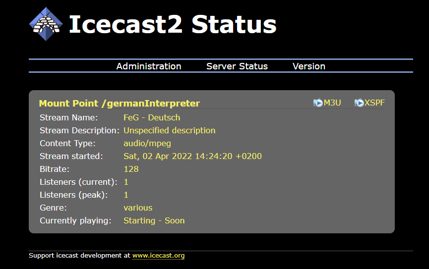

# interpreter-service


## Running nodejs project
- Project setup: `npm install`
- Compile and hot-reload `npm run serve` (during development)
- Compile for production `npm run build`
- Linting and fixing `npm run lint`
See [Configuration Reference](https://cli.vuejs.org/config/).

## Installation Remarks 
This service is tested in production with nginx. 

The production route is set by `vue.config` to `'<ip>/interpreter/stations/'`
``` js
publicPath: process.env.NODE_ENV === 'production'
? '/interpreter/stations/'
: '/'
```

The compiled output is to be copied to `/var/www/interpreter/stations/`.
Ownership is to be adjusted accordingly.

Nginx registers this app by following snippet
``` conf
# Radio-App
location ^~  /interpreter/stations/ {
    root  /var/www;
}
```

## Usage in Production
The App is started by navigation to `http://<server-Ip>/interpreter/stations/` 
in your browser.
On Load the app
- queries the registered Icecast streaming service api 
    (on api route: `http://<ip>:8000/status-json.xsl`),
- and displays the available radio stations in a list-view while exposing the
    `server_name`-field value in the caption of the radio station
    (which is used to show targeted language).
- If the `title`-field is also set this will be also appended to the caption as 
    additional information.

The user can then listen to the demanded interpreter by clicking on the 
correspondent play button

The next three pictures show as an example how a active broadcast is displayed 
in the Icecast status view and in the radio-app view:





