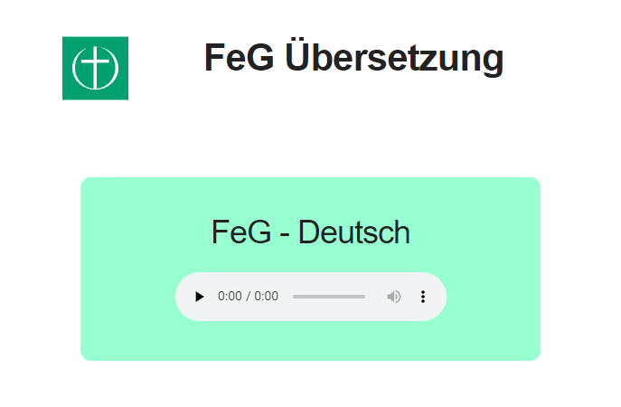

# interpreter-service

## Installation Remarks 
This service is tested in production with nginx. 
The project can be copied as is to `/var/www/interpreter/stations/`.

## Usage in Production
In general this app works just like the *radio-app*. The only difference is that 
it does not try to format the controls in a fancy way because i feared 
compatibility issues on certain devices.